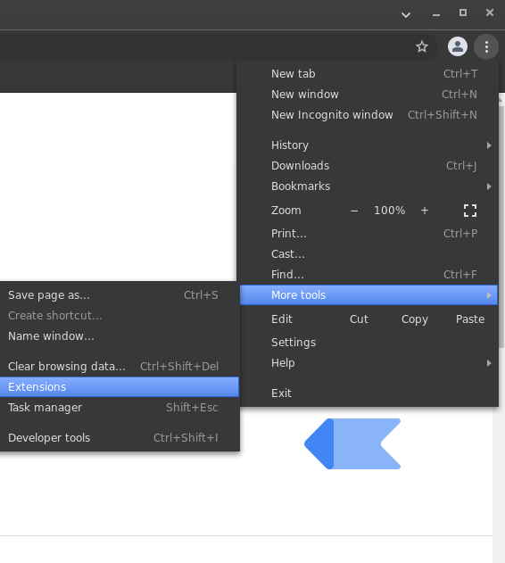
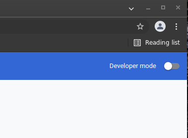
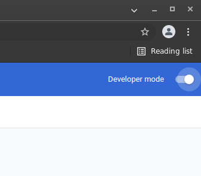
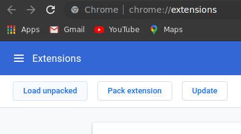
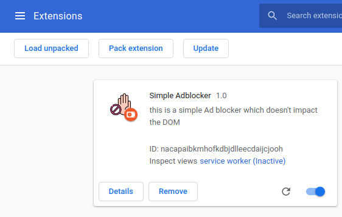

# **A simple AdBlocker**

## **What it does**

***

This extension blocks ads on webpages. **Please note** that this extension is for chrome based browsers.

 

## **How to install**

___

* In order to install this extension you have to download the code on your machine and save the unzipped version in a folder.  
* Once you have done this, open your **chrome** webbrowser and go the the Extensions window by clicking on the 
 **vertical 3 dotted menu on the right > More tools > Extensions**

    

 

* Now, in the new window toogle the **Developer mode** on: 

    Before

    

     

    After

    

     

* As soon as you enable the Developer mode, some buttons will be showed on the top left of your browser window. Click on the **Load unpacked** button on the left:

    

 

* Navigate to the folder where you have unpacked the extensions code and click on Open.

    Done, the extension is installed

    